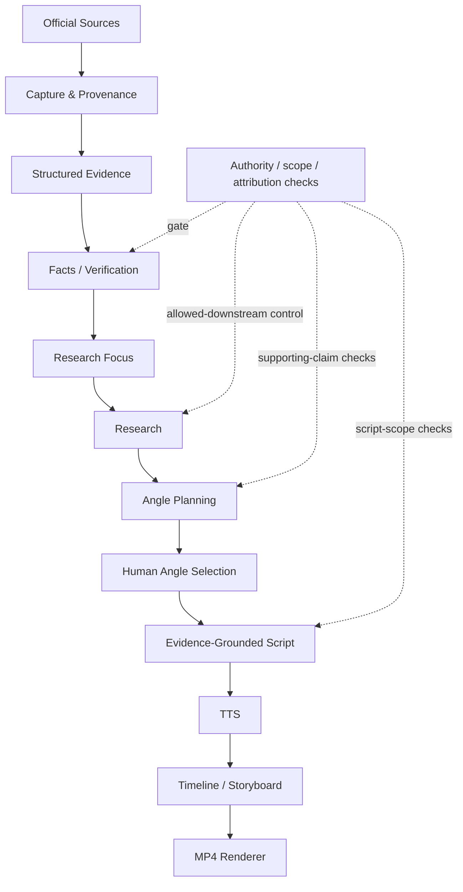

# Fanglei Economy Content Engine

**Evidence-Grounded AI Economic Content & Video Generation Pipeline**

一套从官方原始资料、结构化证据、事实核验、研究与选题，到脚本、配音和最终短视频的端到端 AI 内容生产系统。

> **核心原则：**AI 可以参与研究、表达与创意，但不能自己决定未经验证的事实是否可以进入最终内容。这里不是让 LLM 直接读网页然后写财经稿：证据身份、来源范围和下游资格都有可审计的校验边界。

**已完成真实 Fed Case 2 视频演示：**1080×1920 竖屏 MP4，约 74.6 秒。案例的来源、事实、画面与验证记录见 [Fed Case 2 Video MVP](docs/FED_CASE_2_DEMO.md)。

## Demo：从原始来源到短视频

项目把一次经济内容研究整理成可检查的本地 run：每份来源保留 URL 和 capture provenance；人工审阅官方来源包；通过验证的 claim 才能进入研究和内容流程；最后由人工选择 angle，再生成脚本、旁白、时间线、分镜和视频。

Fed Case 2 对比 2026 年 6 月与 9 月 SEP，并将预测变化与 9 月 FOMC statement 并列呈现。最终视频参数为 **1080×1920、30 FPS、H.264/AAC、8 个场景、12 个句级字幕片段**。字幕采用 sentence-level proportional timing，不是 WhisperX word-level forced alignment。

仓库 `.gitignore` 明确忽略 `*.mp4`，所以当前 README 链接到完整的[案例记录](docs/FED_CASE_2_DEMO.md)，而不放一个并不存在的公开视频链接。MP4 保留在本地 run 目录 `runs/2026-09-24-001-fed-sep-case-2-source-inventory/final.mp4`；若要提供 GitHub 上的下载或播放链接，建议将其作为 GitHub Release asset 发布，再把真实 Release URL 加到这里。

## Architecture



`ArtifactRegistry` tracks artifact ownership, hashes, dependencies, and stale state. The checks around verification and attribution limit which claims may travel downstream; an authority-package approval does not automatically verify every claim or increase independent-source count.

## Fed Case 2：真实案例

**研究问题：**从 2026 年 6 月到 9 月，美联储参与者对增长、失业率、通胀和利率路径的预测发生了什么变化？这些变化与 9 月会议公开表达的经济和通胀判断如何对应？

SEP 表示 **FOMC participants 的 projections / assessments**，不是委员会统一承诺。FOMC statement 则是委员会的公开会议声明。案例只比较官方材料中记录的内容，不把并列关系写成因果解释。

| 2026 median measure | June SEP | September SEP | Verified change |
|---|---:|---:|---:|
| Real GDP growth | 2.2% | 2.3% | +0.1 percentage point |
| Unemployment rate | 4.3% | 4.1% | −0.2 percentage point |
| PCE inflation | 3.6% | 3.7% | +0.1 percentage point |
| Core PCE inflation | 3.3% | 3.4% | +0.1 percentage point |
| Appropriate federal funds rate assessment | 3.8% | 4.1% | +0.3 percentage point |

这些数值不是 README 的手工答案来源：它们来自 June 与 September 的已批准 Federal Reserve captures，经结构化表格证据绑定后，在当前 run 中标记为 `verified`，并允许进入下游内容。9 月声明的经济活动与通胀表述也作为独立的 document-attested facts 使用。

## 为什么要做 evidence-grounded

每条事实都要能回到具体文档、capture、证据片段与范围。经人工批准的 authoritative source package 说明哪些正式材料可用于本案例；claim-level verification 仍单独判断证据是否直接支持所述命题。`verification_basis` 区分独立来源互证和官方文档直接记载，`allowed_downstream` 则由资格规则计算，而不是由模型自我声明。

`research_focus` 将案例问题、子问题和表达边界明确保存；Research 综合只使用可下游使用的事实。Angle planning 可离线、确定性运行，但 angle 仍由人选择。脚本继续检查来源 attribution 与 authority scope，避免把参与者预测改写成委员会承诺，或把文档记载扩展成未经支持的因果判断。

## Why fail-closed matters

第一次处理 SEP 数值时，表格中的数字虽然肉眼可见，但证据尚未建立“指标行 → Median 列 → 2026 年份列 → 数值单元格”的关系。Factcheck 因此没有把五项比较标为 verified。

后来实现结构化 table evidence extraction，将指标、表头、统计口径、年份和值绑定到可定位的 capture evidence 后，比较才通过验证。系统宁可暂停，也不会因为模型“看起来知道答案”就放行事实进入视频。

## 视频成品

- 时长：约 74.633 秒；旁白约 74.626 秒
- 画幅：1080×1920，30 FPS
- 编码：H.264 video + AAC audio
- 结构：8 个场景、12 个句级字幕片段
- 旁白：经人工批准的 Volcengine TTS
- timing：按规范化文本长度比例分配到句子边界；**不是 WhisperX word-level forced alignment**

当前 MP4 留在被忽略的 run 目录中，并未作为仓库资产提交。查看[完整案例与 SHA-256](docs/FED_CASE_2_DEMO.md)。公开作品集托管建议使用 GitHub Release asset；待创建真实 Release 后再将实际 URL 放入 README。

## 已实现的工程要点

- **Source provenance：**记录 exact source identity、URL、capture hash、review metadata 与 artifact freshness。
- **Human-reviewed source package：**官方材料包需要显式批准；审批绑定具体 run、case、文档身份和 hashes。
- **结构化表格证据：**把 metric、header、period、statistic 和 value 建立可追溯关系。
- **Facts 2.2 与 verification basis：**保留 claim 状态，并区分独立互证和 authoritative primary attestation。
- **Fail-closed downstream gate：**没有足够证据或 attribution/scope 不匹配的 claim 不会自动进入内容。
- **Research focus separation：**研究问题与素材发现阶段分开，便于锁定案例范围。
- **Evidence-grounded angle planning：**离线规划候选角度，并让评分和资格由本地规则校验。
- **Human decision boundary：**系统提供候选，但 angle 由人选择。
- **Script authority safety：**保留 attribution 和 authority scope，拒绝不受支持的因果或承诺表述。
- **Deterministic visual pipeline：**结构化 storyboard、timeline、caption 和 renderer project 可检查、可验证。

## Tech Stack

Python 3.11+、Pydantic v2、Typer、pytest、jsonschema、pypdf、FFmpeg/FFprobe、HTML/CSS/JavaScript、HyperFrames 0.8.20，以及本案例实际使用的 Volcengine TTS。可选 Research/provider integrations 另行配置；它们不是 Fed demo 的事实来源或 angle-planning 依赖。

## 项目结构

```text
src/fanglei/                  Python pipeline、models、providers、registry
tests/                        unit / regression tests
docs/                         contracts、runbook、project state、case study
cases/fed-sep-revisions/      Fed SEP case identity 与状态
runs/                         本地生成的运行产物（不提交到 Git）
```

## Quick Start

需要 Python 3.11 或更高版本。Windows PowerShell：

```powershell
python -m venv .venv
.\.venv\Scripts\python.exe -m pip install -e ".[dev]"
.\.venv\Scripts\python.exe -m pytest tests --ignore=tests/integration -p no:cacheprovider --basetemp .venv/pytest-tmp -q
```

macOS/Linux 将解释器路径替换为 `.venv/bin/python`。网络搜索、实时 provider、语音服务和完整媒体生成需要各自的配置与人工审批；上述测试命令不运行 integration suite，也不承诺一条命令即可重建全部在线阶段。

更多入口：

- [Runbook](docs/RUNBOOK.md)
- [Project state](docs/PROJECT_STATE.md)
- [Current handoff](docs/CURRENT_HANDOFF.md)
- [Fed Case 2 demo record](docs/FED_CASE_2_DEMO.md)
- [Authoritative Primary Evidence contract](docs/AUTHORITATIVE_PRIMARY_EVIDENCE_CONTRACT.md)

## Tests

最近 safe non-integration regression：**672 passed**。这个数字对应 `tests --ignore=tests/integration`，不是整个 integration suite 的总测试数。

## 当前限制与后续改进

- Fed demo 使用句级比例计时，未使用 WhisperX 词级强制对齐；精细字幕节奏可在后续升级。
- 当前视觉设计服务于 MVP 的数据卡片与对比表达，仍有进一步视觉打磨空间。
- 本 demo 的 angle planning 离线、确定性完成；live LLM planning 不是演示链路的必要组成部分。
- MP4 目前是本地 run 产物；要公开播放或下载，应先发布真实 GitHub Release asset。
- 网络检索、provider、TTS、字幕对齐和渲染各有独立配置与批准边界；当前没有自动发布到社交平台的功能。

## Case Study

查看 [Fed Case 2：官方 SEP 对比到 74 秒视频](docs/FED_CASE_2_DEMO.md)，包括来源审批和发布日期 provenance、Facts 2.2、Research、五个 eligible angles、人工选择的 `angle_001`、旁白与最终媒体的验证记录。
