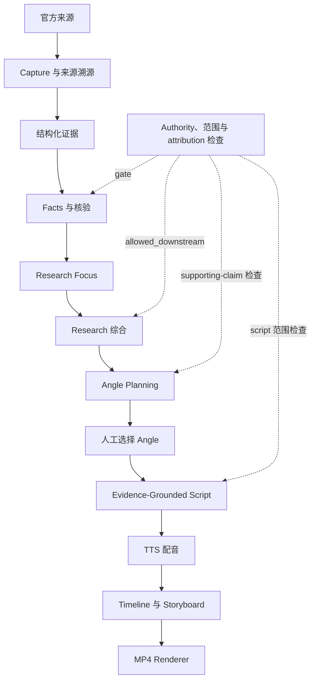

# 风雷经济内容引擎

> **Fenglei Economy Content Engine**
> Evidence-Grounded AI Economic Content & Video Generation Pipeline

一套从官方原始资料、结构化证据、事实核验、研究与选题，到脚本、配音和短视频成品的端到端经济内容生产系统。

**真实 Fed Case 2 Demo：**从 2026 年 6 月与 9 月的 Federal Reserve 官方材料出发，完成事实核验、研究、选题、脚本、配音与视频渲染，交付 **1080×1920 竖屏 MP4**。

> **核心原则：**AI 可以参与研究、表达和创意，但不能自己决定未经验证的事实是否可以进入最终内容。

这不是让 LLM 直接读网页然后写财经稿。来源身份、证据范围、claim 验证和下游资格都经过可追溯的检查。

## Demo：从官方来源到短视频

项目把内容生产组织成可审查的本地 run：保留来源与 capture provenance，人工审核 authoritative source package，只让通过资格检查的事实进入研究与内容流程，再由人选择 angle，生成脚本、旁白、时间线、分镜和视频。

Fed Case 2 对比 2026 年 6 月与 9 月的 SEP，并将预测变化与 9 月 FOMC statement 并列呈现。最终视频为 **1080×1920、30 FPS、H.264/AAC、8 个场景、12 个句级字幕片段**。字幕采用 sentence-level proportional timing，不是 WhisperX word-level forced alignment。

▶ [查看 / 下载 Fed Case 2 最终视频](https://github.com/motty63-ctrl/fenglei-economy-content-engine/releases/tag/v0.1.0)

视频通过 GitHub Release 提供；来源、事实、画面与验证记录见[完整案例记录](docs/FED_CASE_2_DEMO.md)。

## 架构



`ArtifactRegistry` 记录产物 owner、hash、依赖和 stale 状态。审批一个官方来源包，不等于自动验证每条 claim，也不会增加 independent source count。

## Fed Case 2：真实案例

**研究问题：**从 2026 年 6 月到 9 月，美联储参与者对增长、失业率、通胀和利率路径的预测发生了什么变化？这些变化与 9 月会议公开表达的经济和通胀判断如何对应？

SEP 表示 **FOMC participants 的 projections / assessments**，不是委员会统一承诺。FOMC statement 是委员会的公开会议声明。案例将两类文件并列比较，不把它们之间的关系写成未经证实的因果解释。

| 2026 年中位数指标 | June SEP | September SEP | 已核验变化 |
|---|---:|---:|---:|
| 实际 GDP 增长 | 2.2% | 2.3% | +0.1 个百分点 |
| 失业率 | 4.3% | 4.1% | −0.2 个百分点 |
| PCE 通胀 | 3.6% | 3.7% | +0.1 个百分点 |
| 核心 PCE 通胀 | 3.3% | 3.4% | +0.1 个百分点 |
| 适当联邦基金利率评估 | 3.8% | 4.1% | +0.3 个百分点 |

这些数值不是从 README 或案例说明中硬编码进 pipeline 的答案，而是从 June 与 September 官方 capture 中提取、绑定结构化表格证据并完成核验后得到的结果。9 月声明中的经济活动和通胀表述作为另一类官方文档事实单独处理。

## 为什么采用 Evidence-Grounded 设计

每条事实都应能回到具体文档、capture、证据片段和适用范围。人工批准的 authoritative source package 确定本案例可使用哪些官方材料；claim-level verification 再判断证据是否直接支持具体命题。`verification_basis` 区分独立来源互证与官方 primary document attestation；`allowed_downstream` 则由完整资格规则决定。

`research_focus` 将案例问题、子问题和表达边界独立记录。Research 只使用允许进入下游的事实。Angle planning 可离线、确定性运行，但候选 angle 仍由人选择。脚本保留 attribution 与 authority scope，避免把参与者预测改写成委员会承诺，或把文件记载扩展成未经支持的因果判断。

## Fail-Closed 示例

第一次处理 SEP 数值时，数字虽然能在表格中看到，但还没有建立“指标行 → Median 列 → 2026 年列 → 数值单元格”的正式证据关系。Factcheck 因此拒绝把五项比较标记为 verified。

后来加入结构化 table evidence extraction，把指标、表头、统计口径、年份和值绑定到可定位的 capture evidence 后，这些比较才通过验证。系统宁可暂停，也不会因为模型“看起来知道答案”就放行事实进入视频。

## 视频成品

- **时长：**约 74.633 秒；旁白约 74.626 秒
- **画幅与帧率：**1080×1920，30 FPS
- **编码：**H.264 视频 + AAC 音频
- **结构：**8 个场景、12 个句级字幕片段
- **配音：**Volcengine TTS
- **字幕计时：**sentence-level proportional timing；尚未使用 WhisperX word-level forced alignment

MP4 是本地 run 产物，尚无已验证的公开下载链接。案例细节、验证记录及文件信息见[完整案例记录](docs/FED_CASE_2_DEMO.md)。

## 工程设计亮点

- **来源溯源：**记录准确的 source identity、URL、capture hash、review metadata 和 artifact freshness。
- **人工审核来源包：**审批绑定具体 run、case、文档身份和内容 hash。
- **结构化表格证据：**明确关联 metric、表头、统计口径、年份和数值。
- **Facts 2.2：**记录 verification status 与 basis，区分独立互证和 authoritative primary attestation。
- **Fail-closed 下游门禁：**证据、attribution 或 scope 不满足要求时，不自动让 claim 进入内容。
- **Research focus 分离：**把研究问题和范围约束作为明确输入保存。
- **离线 Angle Planning：**确定性生成候选内容角度，再通过人工决策选择。
- **Script authority safety：**保留来源归属与适用范围，阻止不受支持的动机、因果或承诺表达。
- **确定性视频链路：**生成可检查的 storyboard、timeline、caption 和 renderer project。

## 技术栈

Python 3.11+、Pydantic v2、Typer、pytest、jsonschema、pypdf、FFmpeg/FFprobe、HTML/CSS/JavaScript、HyperFrames 0.8.20，以及本案例使用的 Volcengine TTS。可选 Research/provider integrations 需要单独配置；它们不是本 Demo 的事实来源或离线 angle-planning 依赖。

## 项目结构

```text
src/fanglei/                  Python pipeline、models、providers、registry
tests/                        unit / regression tests
docs/                         contracts、runbook、project state、case study
cases/fed-sep-revisions/      Fed SEP case identity 与状态
runs/                         本地运行产物（不提交到 Git）
```

对外品牌使用“风雷经济内容引擎 / Fenglei Economy Content Engine”；`src/fanglei/` 和 Python import 等名称是内部兼容标识，保持不变。

## Quick Start

需要 Python 3.11 或更高版本。Windows PowerShell：

```powershell
python -m venv .venv
./.venv/Scripts/python.exe -m pip install -e ".[dev]"
./.venv/Scripts/python.exe -m pytest tests --ignore=tests/integration -p no:cacheprovider --basetemp .venv/pytest-tmp -q
```

macOS/Linux 可将解释器路径替换为 `.venv/bin/python`。网络检索、实时 provider、语音服务和完整媒体生成需要各自配置与批准；以上命令不运行 integration suite，也不承诺一条命令即可重建所有在线阶段。

更多项目入口：

- [运行手册](docs/RUNBOOK.md)
- [项目状态](docs/PROJECT_STATE.md)
- [当前交接](docs/CURRENT_HANDOFF.md)
- [Fed Case 2 案例记录](docs/FED_CASE_2_DEMO.md)
- [Authoritative Primary Evidence 合约](docs/AUTHORITATIVE_PRIMARY_EVIDENCE_CONTRACT.md)

## 测试

最近记录的 safe non-integration regression 为 **672 passed**。这是 `tests --ignore=tests/integration` 的结果，不代表 integration suite 也包含在该数字中。

## 当前限制与后续方向

- 当前 Demo 字幕使用句级比例计时，尚未采用 WhisperX 词级强制对齐。
- 视觉部分满足 MVP 的数据卡片与对比表达，仍有进一步打磨空间。
- 本案例 angle planning 离线、确定性完成；live LLM planning 不是演示链路的必要组成部分。
- 视频目前保留在本地 run；公开播放或下载前，需要发布并验证真实的 Release asset。
- 网络检索、provider、TTS、字幕对齐和渲染各有配置与批准边界；项目目前没有社交平台自动发布功能。

## Case Study

查看 [Fed Case 2：从官方 SEP 对比到短视频](docs/FED_CASE_2_DEMO.md)，了解来源审批与发布日期 provenance、Facts 2.2、Research Focus、Research、5 个 eligible angles、人工选择的 `angle_001`、证据约束脚本、旁白以及最终视频验证记录。
