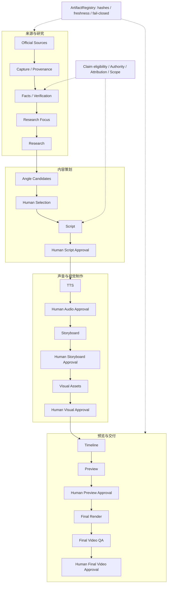

# 风雷经济内容引擎

> **Fenglei Economy Content Engine**
> Evidence-Grounded AI Economic Content & Video Workflow

一套经过两个真实经济案例验证的 Evidence-Grounded AI 经济短视频生产工作流。从官方原始资料出发，把事实、证据和适用范围结构化，再经过研究、选题、脚本、配音与视频制作，交付可以追溯和复核的竖屏视频。

**AI 可以参与研究、表达和创意，但不能自己决定未经验证的事实是否可以进入最终内容。** 系统在下游使用事实前检查资格，在关键制作节点记录人工决定，并用内容 hash 和依赖关系检查批准是否仍然有效。

**V0.2 已验证：**在 Federal Reserve 首个视频 MVP 的基础上，同一套通用工作流完成了 BLS 第二个真实经济案例，没有新增 BLS 专用生产分支。BLS 最终视频已获人工批准，工作流已验收；分支尚未合并，V0.2 尚未公开发布。

▶ [查看 / 下载 Fed 视频（v0.1.0 Release）](https://github.com/motty63-ctrl/fenglei-economy-content-engine/releases/tag/v0.1.0)
📋 [BLS V0.2 验收记录](cases/bls-aug-2026-employment/V0_2_ACCEPTANCE_REVIEW.md) · [最终视频审阅记录](cases/bls-aug-2026-employment/FINAL_VIDEO_REVIEW.md)

## 两个真实案例验证

| 案例 | 官方材料 | 验证目的 | 视频 | 当前状态 |
|---|---|---|---|---|
| Case 1：Federal Reserve | 2026 年 6 月与 9 月 SEP、对应 FOMC statements | 验证从证据到视频的初始端到端可行性 | 约 74.633s；8 场景、12 字幕片段 | V0.1.0 已公开发布 |
| Case 2：BLS | August 2026 Employment Situation 与 July release archive | 验证同一生产工作流可用于第二个经济主题 | 58.710s；9 场景、12 字幕片段 | 最终视频已批准，V0.2 已验收；视频仍在本地 |

这是两个不同的**项目案例**，不表示单条事实获得了两个独立机构的互证。每个案例的 authoritative source package 都保持真实的 independent source count。

## 工作流

下图展示已验收的 V0.2 生产路径；legacy/default API 的兼容路径不一定要求其中每一个人工门禁。


```mermaid
flowchart TB
    subgraph E[来源与研究]
        direction LR
        A[Official Sources] --> B[Capture / Provenance]
        B --> C[Facts / Verification]
        C --> D[Research Focus] --> F[Research]
    end
    subgraph P[内容策划]
        direction LR
        G[Angle Candidates] --> H[Human Selection]
        H --> I[Script] --> J[Human Script Approval]
    end
    subgraph M[声音与视觉制作]
        direction LR
        K[TTS] --> L[Human Audio Approval]
        L --> N[Storyboard] --> O[Human Storyboard Approval]
        O --> Q[Visual Assets] --> R[Human Visual Approval]
    end
    subgraph V[预览与交付]
        direction LR
        S[Timeline] --> T[Preview] --> U[Human Preview Approval]
        U --> W[Final Render] --> X[Final Video QA]
        X --> Y[Human Final Video Approval]
    end
    F --> G
    J --> K
    R --> S
    Z[Claim eligibility / Authority / Attribution / Scope] -.-> C
    Z -.-> I
    AA[ArtifactRegistry: hashes / freshness / fail-closed] -.-> E
    AA -.-> V
```

## 为什么要 Evidence-Grounded

财经内容的风险往往出现在“资料是真的，但表达扩大了事实范围”。项目把来源包审批、单条事实验证和内容审核分开：批准官方材料不等于批准所有未来 claims，更不等于批准因果、动机或市场影响解释。

在 V0.2 内容路径中，只有 `verification_status=verified` 且 `allowed_downstream=true` 的 claim 才能进入 Research、Angle 和 Script 的事实上下文。Facts 2.2 还区分独立互证与 `authoritative_primary_attestation`：后者证明获批官方文件记载了什么，不能把参与者预测变成政策承诺，也不能把相关信息写成因果解释。结构化检查和人工审核共同守住边界，不宣称自动证明任意自然语言命题。

**一次真实的 fail-closed：**处理 SEP 时，表中数字肉眼可见，但最初没有正式绑定“指标行 → Median 列 → 2026 列 → 数值单元格”，五项比较因此未获 verified。建立结构化表格证据和可定位的绑定后，验证才通过。系统不会因为模型看起来知道答案就放行。

## V0.2：从单案例 MVP 到可复用工作流

V0.1 证明了一条 Fed 视频链路可行；V0.2 将其中的主题假设移到输入，补齐通用合同，并在 BLS 实例上完成验收。

- **统一事实资格：**Research、Angle、Script 共用资格判断；跨语言术语需要人工审核并绑定当前 Facts。
- **明确人工决策：**推荐与选择分离，内容和媒体审批绑定具体产物及上游 hash。
- **内容与声音分离：**保留已批准的显示文本，另行生成 TTS spoken text；数值读法不改写事实。
- **按真实音频制作：**Storyboard 绑定时间和句段覆盖；支持人工视觉恢复、移动端排版与停顿细化的句级计时。
- **独立交付验证：**渲染使用确定性时钟；Final Candidate 不可变，QA 单独保存，失败和后续 QA attempts 都可追溯，再进入人工终审与工作流验收。

## 案例摘要

### Federal Reserve：第一条真实视频链路

对比 2026 年 6 月与 9 月的参与者 SEP median projections，并与会议声明并排呈现。五项比较由获批 Federal Reserve captures 提取和核验，数字详情见 [Fed 案例记录](docs/FED_CASE_2_DEMO.md)。SEP 是 **FOMC participants 的 projections / assessments**，不是委员会统一承诺；FOMC statement 则是委员会的公开声明。

成品：1080×1920、30 FPS、H.264/AAC、约 74.633s，Volcengine 配音。历史文档称其为 “Fed Case 2”；在本项目两案例验证中，它是第一个 Video MVP。旧的 blocked checkpoint 未被修复或升级。

### BLS：第二个真实案例验证通用性

以 August 2026 Employment Situation 为主题，保留 Household Survey 与 Establishment Survey 的统计边界，并区分当月变动与历史修订。下游使用 **9 条 eligible claims**，用户从候选角度中选择 `angle_001`，脚本、声音、视觉、预览和最终视频分别经过人工审阅。

| 最终产物 | 已验收结果 |
|---|---|
| 时长 / 画幅 / 帧率 | 58.710s / 1080×1920 / 30 FPS |
| 视频 / 音频 | H.264 / AAC |
| 场景 / 字幕 | 9 scenes / 12 subtitle cues |
| Final Video QA | Attempt 2：20/20 passed；失败 Attempt 1 保留 |
| 人工终审 / 工作流验收 | APPROVED / V0.2_ACCEPTED |

Final media SHA-256：

```text
5167703eeb0dd1855c30c2012ad0f1a44dbbed6617f27231b34332f93c723cdd
```

BLS MP4 仍是本地 ignored run 产物，**尚无公开下载地址**。可先查看 [V0.2 验收报告](cases/bls-aug-2026-employment/V0_2_ACCEPTANCE_REVIEW.md) 与 [Final Video Review](cases/bls-aug-2026-employment/FINAL_VIDEO_REVIEW.md)；公开发布需要另行决定。

## 人工门禁是产品设计的一部分

V0.2 生产路径要求明确的 Angle selection，并在需要时审核跨语言术语，随后分别批准 Script、Audio、Storyboard、Visual、Preview 和 Final Video。每项决定绑定被审阅对象和相关依赖 hash；相关上游变化会使下游审批 stale，不能沿用旧批准继续制作。

来源审批只决定材料包是否可用；技术 QA 通过只打开人工终审；最终视频批准和 V0.2 工作流验收也不自动授权公开发布。离线生成、排序和规则检查可以自动运行，但系统推荐不代表人工选择。这里描述的是显式启用的 V0.2 路径，不改变 legacy API 的既有合同。

## 工程设计亮点

- **可复核的证据链：**source identity、exact URL、capture hash、locator/excerpt、claim 与内容引用保持可追溯。
- **ArtifactRegistry：**owner、hash、依赖和 freshness 分开记录；上游变更自然使下游 stale。
- **范围安全：**attribution、统计口径、时期、单位和 revision role 参与检查；无资格或无法证明时拒绝进入内容。
- **可审计的人工恢复：**脚本与视觉修改走正式 owner，不以直接编辑 JSON 跳过门禁；历史拒绝和技术失败保留。
- **候选与评估分离：**Final Candidate 固定媒体身份，QA 与人工决定独立记录，不改写候选以伪装通过。

## 我的职责与贡献

- 定义问题、目标和工作流，设计事实与 authority 边界、人工门禁及验收标准。
- 负责两个真实案例的选择、材料与内容审核、选题、QA 决策和交付验收。
- 使用 ChatGPT / Codex 辅助代码实现、调试、测试和文档整理，对产品决策、事实边界和最终交付结果负责。

这是 AI 辅助工程项目，不以“独立手写全部代码”作为成果描述。

## 技术栈

Python 3.11+、Pydantic v2、Typer、pytest、jsonschema、pypdf；Node.js、HTML/CSS/JavaScript、SVG、HyperFrames 0.8.20、FFmpeg/FFprobe。真实案例使用 Volcengine TTS；在线 Script provider 可使用 DeepSeek。Provider 输出仍须经过相应规则与人工门禁，不充当事实证据。

## 测试证据

最新已记录的 **safe non-integration regression：1018 passed、3 skipped、0 failures/errors**；最新相关 MP4/QA focused：**57 passed**。

这不包含 integration suite。3 个 skipped tests 需要显式的本地 renderer-level 工具配置，未当作已通过。本次文档包装不改生产代码或 tests，沿用上述验证记录，不重复运行全量回归。详细边界见 [验收报告](cases/bls-aug-2026-employment/V0_2_ACCEPTANCE_REVIEW.md)。

## 项目结构

```text
src/fanglei/                      pipeline、models、providers、registry、media owners
tests/                            focused / regression tests
docs/                             contracts、runbook、project state、case studies
cases/fed-sep-revisions/           冻结的 Fed MVP 与历史证据
cases/bls-aug-2026-employment/     BLS review / approval / acceptance 审计记录
tools/ffmpeg/                     项目本地 FFmpeg/FFprobe 依赖与配置
runs/                            本地运行产物（ignored，不提交）
```

`tools/ffmpeg/package-lock.json` 固定工具依赖；`node_modules/` 不跟踪。对外品牌是“风雷经济内容引擎 / Fenglei Economy Content Engine”；`src/fanglei/`、Python imports 和内部 identifiers 保持兼容命名。

## Quick Start

需要 Python 3.11+。Windows PowerShell 的开发环境与安全测试入口：

```powershell
python -m venv .venv
./.venv/Scripts/python.exe -m pip install -e ".[dev]"
./.venv/Scripts/python.exe -m pytest tests --ignore=tests/integration -p no:cacheprovider --basetemp .venv/pytest-tmp -q
```

macOS/Linux 使用 `.venv/bin/python`。完整媒体链路还需要 Node.js、浏览器与媒体工具；参见 [本地 FFmpeg 配置](tools/ffmpeg/README.md) 和 [RUNBOOK](docs/RUNBOOK.md)。在线检索、Script provider、TTS 各需私密凭证与阶段授权，请勿把凭证写入仓库。以上不是一条命令复现所有在线阶段的承诺。

## 当前限制与后续方向

- BLS 字幕使用 **sentence-level pause-refined timing**，不是 word-level forced alignment；Fed V0.1 使用句级比例计时。
- 视觉以静态 SVG 和程序化 motion 为主，尚不是完整动画设计系统。
- 在线 providers 和媒体工具需配置，部分 renderer-level tests 依赖显式本地设置。
- 流程需要人工内容与媒体判断，不是一次点击即可完成的全自动生产系统。
- 尚无社交平台自动发布；词级对齐、视觉升级与交互入口属于后续方向，不是 V0.2 已交付能力。

## 延伸阅读

- [项目状态](docs/PROJECT_STATE.md) · [当前交接](docs/CURRENT_HANDOFF.md)
- [V0.2 通用化计划及历史阶段](docs/v0.2/GENERALIZATION_PLAN.md)
- [合并与发布准备](docs/v0.2/RELEASE_READINESS.md)
- [Fed 案例记录](docs/FED_CASE_2_DEMO.md)
- [BLS 工作流验收](cases/bls-aug-2026-employment/V0_2_ACCEPTANCE_REVIEW.md)
- [Authoritative Primary Evidence contract](docs/AUTHORITATIVE_PRIMARY_EVIDENCE_CONTRACT.md)
